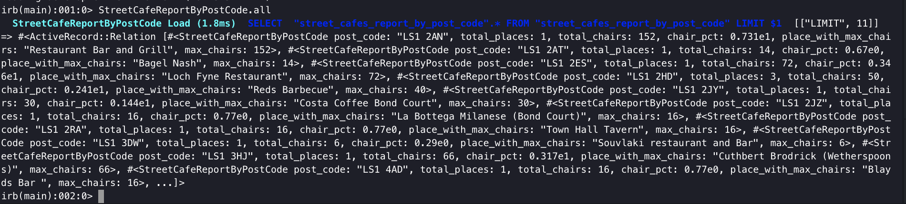
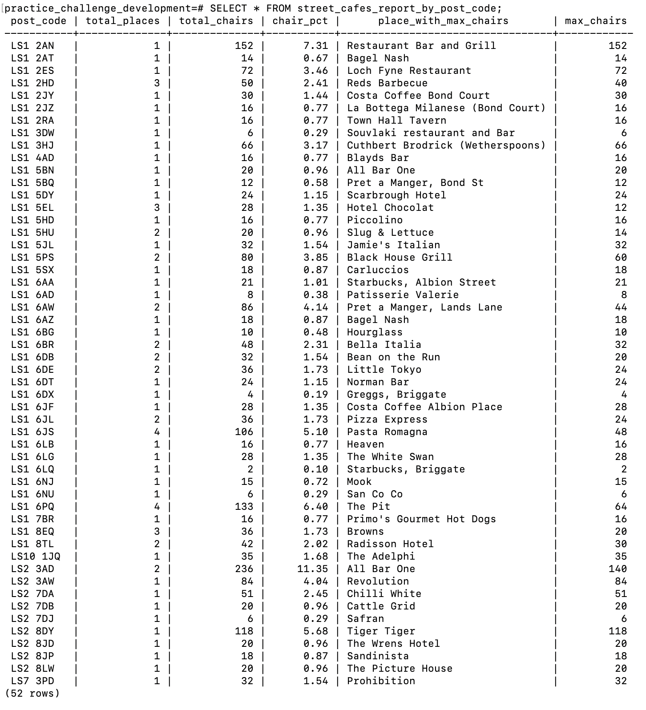
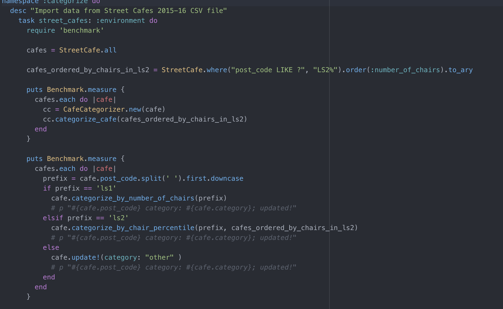
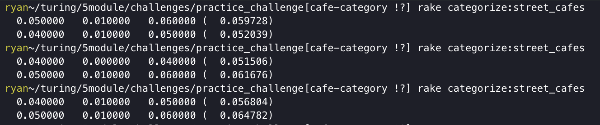
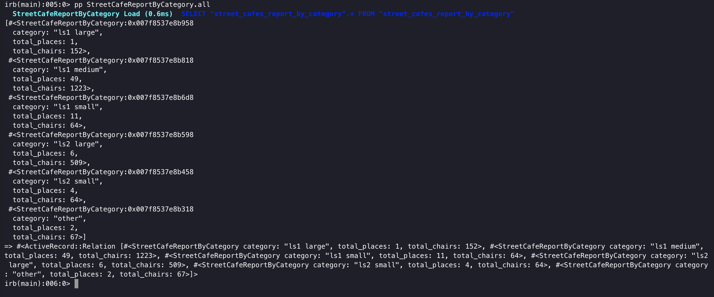

### Welcome to the take home portion of your interview! We're excited to jam through some technical stuff with you, but first it'll help to get a sense of how you work through data and coding problems. Work through what you can independently, but do feel free to reach out if you have blocking questions or problems.

1) This requires Postgres (9.4+) & Rails(4.2+), so if you don't already have both installed, please install them.

First I cloned down the repository and copied the street cafes 2015-16 csv into the project using Rails 5.2.4.1. Then I created a street_cafe model to represent the data with attributes of each column. I also added an additional column 'bench_seating' as string type since one restaurant had additional information regarding bench seating. I did not validate bench_seating in the model due to not every restaurant having bench seating. I created a database using postgres 11.3, to meet the requirement of Postgres (9.4+) and ran the migration to create the initial table. Upon running the migration, I realized the table name was pluralized to `street_caves` instead of `street_cafes`. To solve this issue, I had to create and inflection. In config/initializers/inflections.rb, I had to update the file to:

  `ActiveSupport::Inflector.inflections(:en) do |inflect|
    inflect.plural "cafe", "cafes"
  end`

2) Download the data file from: https://github.com/gospotcheck/ps-code-challenge/blob/master/Street%20Cafes%202015-16.csv

3) Add a varchar column to the table called `category`.

    In terminal I ran `rails g migration AddCategoryColumnToStreetCafe category:varchar` to add category column with a type of varchar to the street_cafes table.

4) Create a view with the following columns[provide the view SQL]
    - post_code: The Post Code
    - total_places: The number of places in that Post Code
    - total_chairs: The total number of chairs in that Post Code
    - chairs_pct: Out of all the chairs at all the Post Codes, what percentage does this Post Code represent (should sum to 100% in the whole view)
    - place_with_max_chairs: The name of the place with the most chairs in that Post Code
    -max_chairs: The number of chairs at the place_with_max_chairs

    To get this data, I created a rake task to import the csv data into the database. Since the data was missing a header for a column, I added bench_seating header during the rake task. I also had to add `encoding: 'ISO-8859-1'` in the options for the special character accent on cafe.`

    To run rake task, run:

    `rake import:street_cafes`

    I created a SQL view migration by running `rails g migration street_cafe_report_by_post_code_view`. I then input the SQL to query the desired data and ran a migration, which in the console output:

    `
    == 20200429171537 StreetCafeReportByPostCodeView: migrating ===================
    -- execute("          CREATE VIEW street_cafes_report_by_post_code AS\n            SELECT\n              post_code,\n              COUNT(*) AS total_places
    ,\n              SUM(number_of_chairs) AS total_chairs,\n              ROUND((SUM(number_of_chairs) * 1.0 / (SELECT SUM(cafes.number_of_chairs)* 1.0 FROM s
    treet_cafes cafes) * 100), 2) AS chair_pct,\n              (SELECT restaurant_name FROM street_cafes sc WHERE sc.post_code = street.post_code ORDER BY numb
    er_of_chairs desc LIMIT 1) AS place_with_max_chairs,\n              MAX(number_of_chairs) as max_chairs\n            FROM\n              street_cafes stree
    t\n            GROUP BY\n              post_code\n            ORDER BY\n              post_code\n")
       -> 0.0187s
    == 20200429171537 StreetCafeReportByPostCodeView: migrated (0.0188s) ==========
    `

    To make the query accessible by ActiveRecord, I then created `street_cafe_report_by_post_code.rb` model and updated the file to:

    `
    class StreetCafeReportByPostCode < ApplicationRecord

      self.primary_key = :id

      def readonly?
        true
      end
    end
    `

    I can now access this in the rails console with ActiveRecord by running in the console:

    `rails c`
    `pp StreetCafeReportByPostCode.all`

    

    I can also run additional queries on that view like:

    `StreetCafeReportByPostCode.where(post_code: "LS2 3AD")`

    and get:

    `irb(main):001:0> StreetCafeReportByPostCode.where(post_code: "LS2 3AD")
    StreetCafeReportByPostCode Load (1.3ms)  SELECT  "street_cafes_report_by_post_code".* FROM "street_cafes_report_by_post_code" WHERE "st
    reet_cafes_report_by_post_code"."post_code" = $1 LIMIT $2  [["post_code", "LS2 3AD"], ["LIMIT", 11]]
    => #<ActiveRecord::Relation [#<StreetCafeReportByPostCode post_code: "LS2 3AD", total_places: 2, total_chairs: 236, chair_pct: 0.1135e2,
    place_with_max_chairs: "Restaurant Bar and Grill", max_chairs: 140>]>
    `

    In the terminal I can also now run `psql database_name`, or in my case `psql practice_challenge_development`. Then I can query
    `SELECT * FROM street_cafes_report_by_post_code;`

    

    *Please also include a brief description of how you verified #4*

    ##Testing

    I created a spec for the SQL to test and validate queries were true. See `./spec/models/street_cafe_report_by_post_code_spec.rb`
    I also did manual testing. I can test in rails dbconsole:

    `SELECT SUM(street_cafes_report_by_post_code.chair_pct) FROM street_cafes_report_by_post_code;`

    or in rails c using ActiveRecord:

    `StreetCafeReportByPostCode.sum(:chair_pct).to_i`

    In order to test this with RSpec, I ran into a problem; In test environment, rails didn't know have a table for StreetCafeReportByPostCode. To resolve this issue I needed to switch my schema to SQL format by adding the following line to my application.rb:

    `config.active_record.schema_format = :sql`

    Then in rspec I could test:

    `expect(StreetCafeReportByPostCode.sum(:chair_pct).to_i).to eq(100)`

    SQL Views do not have primary keys, so unfortunately you cannot call .first, .last, or .find because ActiveRecord expects to query based on your model's primary key. With some queries, ou can get around these issues by setting the primary key column on your Rails model like so:

    `class People < ActiveRecord::Base
      self.primary_key = :my_unique_identifier_field
    end`

    Since my query is a group by, I decided to just access in such a way: `array[0]`

5) Write a Rails script to categorize the cafes and write the result to the category according to the rules:[provide the script]
    - If the Post Code is of the LS1 prefix type:
        - `# of chairs less than 10: category = 'ls1 small'`
        - `# of chairs greater than or equal to 10, less than 100: category = 'ls1 medium'`
        - `# of chairs greater than or equal to 100: category = 'ls1 large' `
    - If the Post Code is of the LS2 prefix type:
        - `# of chairs below the 50th percentile for ls2: category = 'ls2 small'`
        - `# of chairs above the 50th percentile for ls2: category = 'ls2 large'`
    - For Post Code is something else:
        - `category = 'other'`

    Initially, I created a rake task that called street cafe class methods to categorize depending on prefix. I then decided to organize the logic into it's own class, CafeCategorizer.rb. I also benchmarked the two rake tasks and found CafeCategorizer to be faster as long as I queried the 'ls2' in the rake task and passed that variable to the CafeCategorizer instance method categorize_cafe (then I wouldn't be making a query for each time I categorized a cafe with a prefix of 'ls2'. Also, this keeps options open for future iterations to pass other prefixes into the method).

    
    

    *Please share any tests you wrote for #5*

    I wrote unit test for categorizing a cafe with RSpec.

6) Write a custom view to aggregate the categories [provide view SQL AND the results of this view]
    - category: The category column
    - total_places: The number of places in that category
    - total_chairs: The total chairs in that category

    SQL query: `SELECT * FROM street_cafes_report_by_category`

    

    ActiveRecord query: `StreetCafeReportByCategory.all`

    

7) Write a script in rails to:
    - For street_cafes categorized as small, write a script that exports their data to a csv and deletes the records
    - For street cafes categorized as medium or large, write a script that concatenates the category name to the beginning of the name and writes it back to the name column

    Adds an `export_small_street_cafes_to_csv.rake` task to export small cafes csv and delete records. I decided to keep this external from the class because this could be extremely sensitive and you would not want anyone to accidentally delete records. This would create a csv file located in the public directory as `small_street_cafes.csv`.

    I created a simple rake task `concatenate_cafe_category.rake` and used class methods to handle concatenating category into name.

    *Please share any tests you wrote for #7*

8) Show your work and check your email for submission instructions.

9) Celebrate, you did great!
